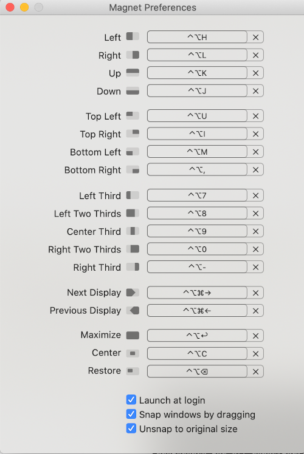

# My dotfiles

## Requirements

* MacOS or Ubuntu
* Git
* admin access

## Installation

Walk through to install and configure a new MacOS laptop

### Install script

```bash
# Clone this repo into your home directory
cd ~
git clone https://github.com/jacobbat/dotfiles.git
# Run the install script
cd dotfiles
./install/install.sh
```

### iTerm

**TODO**: Add iTerm steps

### Magnet
* Log into the app store and install magnet, configure magnet hotkeys as follows:
  
